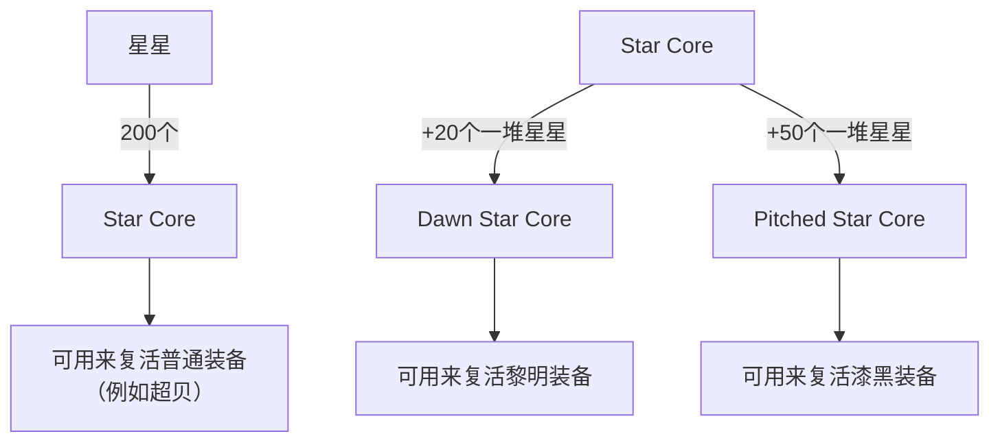

需完成灯泡里的前置，下文不再赘述。

## 复活漆黑途径一

NPC所在地点：海底世界左上角，尖兵老家

打怪爆箱子，箱子可以开出两种星星之一：
- Star Specks，图标为四颗小星星，下图中称之为**星星**
- Shining Star Specks，图标为一堆星星，下图中称之为**一堆星星**

两者是完全不同的两种道具，不能混用。目前前者出率比后者高。**两者都可仓。**

## 复活漆黑途径二

打boss（要求solo），在选择难度界面的左下角，练习模式旁边有另外一个选项，就是给boss上难度。难度一般就是：难度限制、减命数、减终伤、增加受到的伤害，以及一些其它的要求。完成后可以得到点数，把炸了的装备痕迹放上去就可以看到复活需要的点数（复活漆黑需要1600多点数）。

值得注意的点有：
- 必须solo，不能用练习模式
- 难度限制那一行二选一（普通、困难）一定要勾上，不勾白不勾。4m只能困难模式
- 进场直接生效的（减命数、减终伤、增加受到的伤害）是整场有效，而那些完成指定任务（例如C8接线、lsl堵门）如果勾了但没完成，仅这个任务对应的点数无法获取，其它的点数不受影响
- 虽然boss是周四刷新，但是复活漆黑活动是周三刷新，因此周三打的boss算作第二周

## 漆黑保底

NPC所在地点：海底世界左上角，尖兵老家

打boss获得不同的碎片（黎明碎片、漆黑碎片），积攒够数量后前往NPC处兑换。
