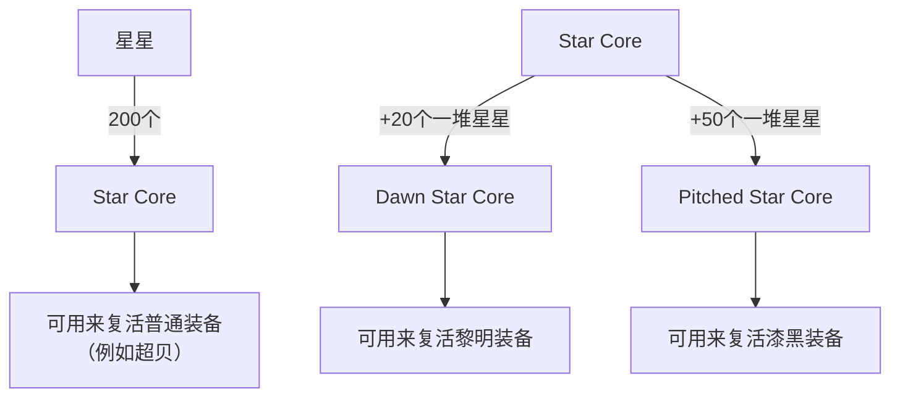

打怪爆箱子，箱子可以开出两种星星之一：
- Star Specks，图标为四颗小星星，下图中称之为**星星**
- Shining Star Specks，图标为一堆星星，下图中称之为**一堆星星**

两者是完全不同的两种道具，不能混用。目前前者出率比后者高。

```mermaid
flowchart TB
  A[星星] -->|200个| B[Star Core] --> B1[可用来复活普通装备<br/>（例如超贝）]
  B2[Star Core] -->|+20个一堆星星| C[Dawn Star Core] --> C1[可用来复活黎明装备]
  B2 -->|+50个一堆星星| D[Pitched Star Core] --> D1[可用来复活漆黑装备]
```